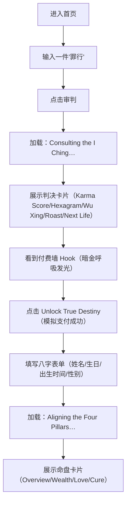

## 1. 产品概述
面向西方年轻人的“东方神秘学 + 赛博朋克”娱乐与算命应用：用免费“毒舌业力审判（易经）”制造情绪波动与敬畏，驱动用户付费解锁“八字（BaZi）深度命运解析”。

- 目标用户：18–35 岁，偏好新奇叙事、meme 文化、赛博审美、轻仪式感占卜娱乐的英语用户
- 核心价值：高冲击的“审判感”内容引流 + 付费后的“专业感/底蕴感”解析交付

## 2. 核心功能

### 2.1 用户角色（可选）
| 角色 | 使用方式 | 核心权限 |
|------|----------|----------|
| 访客用户 | 无需登录 | 免费审判、模拟付费解锁、填写八字并获取解析 |

### 2.2 功能模块
1. **阶段 1：业力审判（免费引流）**：输入“蠢事/错事/罪行” → 加载 → 判决卡片（Karma Score、卦象、五行失调、毒舌判词、下辈子转世）
2. **阶段 2：命运诱饵（模拟付费墙）**：暗金呼吸光的 Hook 区域 → 点击“Unlock”直接平滑过渡到阶段 3（开发期不接真实支付）
3. **阶段 3：赛博八字（高客单交付）**：填写姓名/生日/出生时间/性别 → 推演加载 → 命盘卡片（overview/wealth/love/cure）

### 2.3 页面详情
| 页面名称 | 模块名称 | 功能描述 |
|----------|----------|----------|
| /（单页应用） | 输入区（Karma Roast） | 极简暗黑输入框，收集用户 confession（sin） |
| /（单页应用） | 加载态（I Ching） | “Consulting the I Ching…” 等赛博加载文字/字符滚动 |
| /（单页应用） | 判决卡片 | 展示 roast JSON 的字段：分数、卦象、五行失调、判词、转世物品 |
| /（单页应用） | 付费墙 Hook | 暗金/青铜色呼吸发光，警告文案 + 按钮（开发期模拟支付成功） |
| /（单页应用） | 八字表单 | Name / Date of Birth / Time of Birth / Gender 输入与校验 |
| /（单页应用） | 加载态（Four Pillars） | “Aligning the Four Pillars of Destiny…” 字符滚动动画 |
| /（单页应用） | 命盘卡片（Destiny Scroll） | 展示 destiny JSON 的字段：overview/wealth/love/cure |
| /（单页应用） | 错误态 | API 失败/超时/JSON 不合法时的可恢复错误提示与重试 |

## 3. 核心流程
用户在单页内无缝切换 3 个阶段，强调“仪式感 + 压迫感 + 高级感”的连续体验。

## 4. 用户界面设计

### 4.1 设计风格
- 主题：Cyberpunk Eastern Mysticism（赛博东方神秘学）
- 背景：纯黑 #000000
- 字体：标题衬线体（Serif），正文等宽字体（Monospace）
- 色彩体系：
  - 审判阶段：霓虹血红（强调警告/压迫，参考 text-red-600）
  - 算命阶段：暗金/青铜（高级/古老智慧，参考 text-yellow-600、text-amber-500）
- 动效：状态切换必须有平滑过渡；加载阶段要“有戏”（字符滚动/霓虹闪烁/扫描线）

### 4.2 页面设计概览
| 页面名称 | 模块名称 | UI 元素 |
|----------|----------|---------|
| / | 输入区 | 极简暗黑文本框、微弱霓虹描边、键盘回车提交、输入提示为英文 |
| / | 加载态（I Ching） | 赛博终端字形、随机字符抖动、短句逐行打印 |
| / | 判决卡片 | 高压迫感卡片：红色分数、卦象标题（中英）、段落式 roast、转世物品强调 |
| / | 付费墙 Hook | 暗金呼吸光、微粒噪点、危险提示符、主按钮发光与 hover 反馈 |
| / | 八字表单 | 更“高级”的表单版式：金色细边框、分组排版、移动端易点按 |
| / | 加载态（Four Pillars） | 更复杂的字符滚动与对齐效果，暗金色为主 |
| / | 命盘卡片 | “卷轴/命盘”质感：分区卡片、标题衬线体、正文等宽体、暗金强调 |

### 4.3 响应式
- 以移动端优先：单列布局，卡片与按钮适配小屏宽度
- 触控优化：按钮与输入控件具备足够点击区域
- 动效可降级：低性能设备下仍可阅读与交互（避免强依赖 heavy 动画）

