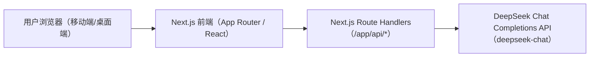
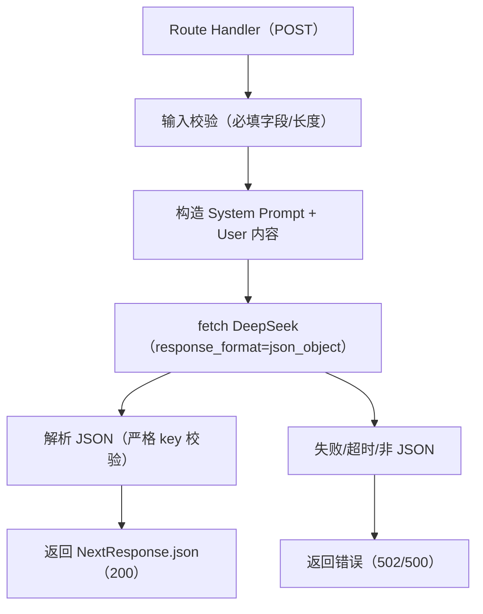

## 1. 架构设计



- 前端负责：三阶段视图切换、动效与加载态、表单校验与展示卡片
- 后端（同仓库同应用）负责：两条 API 路由，调用 DeepSeek，强制 JSON 输出并做基础校验
- 数据存储：无数据库（MVP），所有结果按请求即时生成

## 2. 技术说明
- 前端：Next.js（App Router）+ React + TypeScript + Tailwind CSS
- 后端：Next.js Route Handlers（Node.js runtime，使用 fetch 直连 DeepSeek）
- 外部服务：DeepSeek API `https://api.deepseek.com/chat/completions`
- 配置：通过环境变量提供密钥，不写入仓库
  - `DEEPSEEK_API_KEY`：DeepSeek API Key（必填）

## 3. 路由定义
| 路由 | 用途 |
|------|------|
| / | 单页应用：Karma Roast → Paywall Hook → Cyber BaZi Reading |

## 4. API 定义

### 4.1 通用约束
- 所有接口均为 `POST`，接收 `Content-Type: application/json`
- 调用 DeepSeek 时必须开启强制 JSON：`response_format: { "type": "json_object" }`
- 服务端需要对输出 JSON 做最小校验：必须包含规定 key，且基础字段类型正确
- 错误策略：返回 `{ error: string }`（或 NextResponse.json）并带合适状态码（400/500/502）

### 4.2 类型定义（TypeScript）

```ts
export type RoastRequest = {
  sin: string
}

export type RoastResponse = {
  score: number
  hexagram: string
  element_imbalance: string
  roast: string
  next_life: string
}

export type DestinyRequest = {
  name: string
  birthDate: string
  birthTime: string
  gender: string
}

export type DestinyResponse = {
  overview: string
  wealth: string
  love: string
  cure: string
}
```

### 4.3 接口列表
| 方法 | 路由 | 请求体 | 返回体 |
|------|------|--------|--------|
| POST | /api/roast | RoastRequest | RoastResponse |
| POST | /api/destiny | DestinyRequest | DestinyResponse |

## 5. 服务端调用链（API 路由内部）



## 6. 前端状态机（单页视图切换）
- `Input`：输入 sin
- `RoastLoading`：展示“Consulting the I Ching…”
- `RoastResult`：展示判决卡片
- `PaywallHook`：展示付费墙与按钮
- `BaZiForm`：输入八字信息
- `DestinyLoading`：展示“Aligning the Four Pillars…”
- `DestinyResult`：展示命盘卡片

